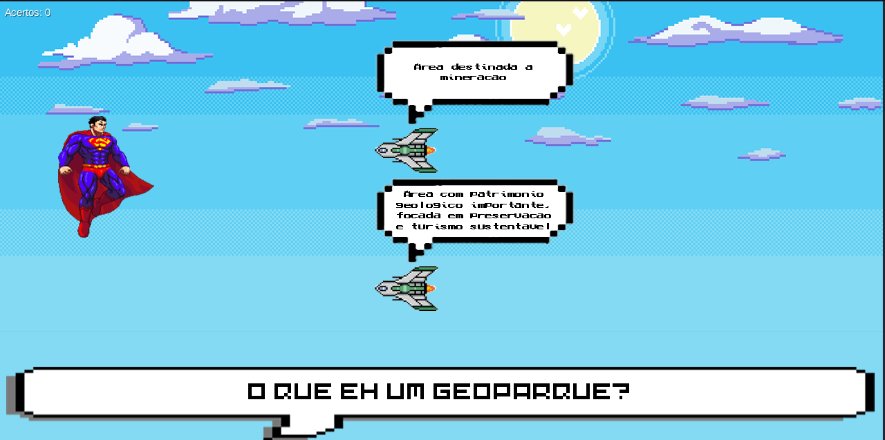

🎮 Superman Dos Pampas 
===

Nesse jogo quiz nós trabalhamos a ideia de valorizar os nossos geoparques presentes no nosso estado do Rio Grande do Sul, por meio de perguntas ilustrativas incentivamos a busca e teste do conhecimento das belezas naturais aqui presentes.

---

## 👾 Jogo

O jogo consiste em você controlar o Superman, que atira laser pelos olhos ao clicar, e o objetivo principal é atirar em uma das naves que irão vir, cada uma com uma resposta para a pergunta que aparecerá na tela sobre o tema de geoparques e apenas uma contendo a resposta correta. 




---
## ⚙️ Parte técnica
    
Para desenvolver esse jogo foi usada a biblioteca [libGDX](https://libgdx.com) do Java, por meio dessa função conseguimos criar a parte gráfica juntamente com a lógica do programa, como por exemplo na função de criar os inimigos:

```java
private void gerarInimigos() {
    float posXInimigo1 = 1400;
    float posYInimigo1 = 200;
    float posXInimigo2 = 1400;
    float posYInimigo2 = 400;

    for (int i = 0; i < 2; i++) {
        Texture inimigoTexture = inimigoTextures[indiceImagem * 2 + i];
        Sprite inimigo = new Sprite(inimigoTexture);

        if (i == 0) {
            inimigo.setPosition(posXInimigo1, posYInimigo1);
        } else {
            inimigo.setPosition(posXInimigo2, posYInimigo2);
        }

        inimigos.add(inimigo);
    }

    indiceImagem++;
    podeResponder = true;
}  
```
___

## Perguntas realizadas:
- O que é um geoparque?
- Onde se localiza o geoparque?
- São exemplos de área de grande beleza:
- Qual é o tipo de turismo promovido?
- É uma comunidade que reside na região:
- O que é ggn?
- Em que ano a UNESCO iniciou com os geoparques?
- Qual bioma predomina no geoparque?
- Uma formação rochosa símbolo do geoparque:
- Qual o objetivo do geoparque?


## Considerações finais:

Acreditamos que realizamos um bom trabalho e também conseguimos instigar as pessoas a procurar por mais conhecimentos da nossa própria cultura e terra natal, fazendo isso de uma forma legal e recreativa para todos os públicos.

---

### Bibliografia:

- [libGDX](https://libgdx.com) e [Documentação](https://libgdx.com/dev/)
- Ferramentas de IA
